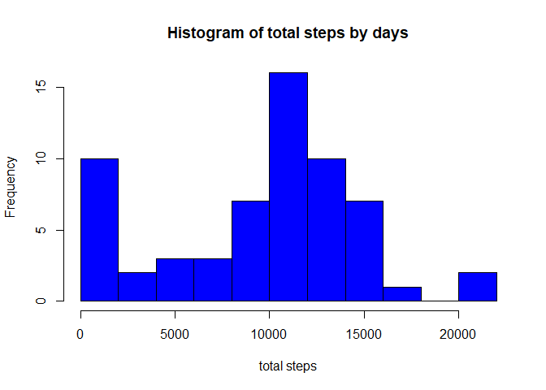
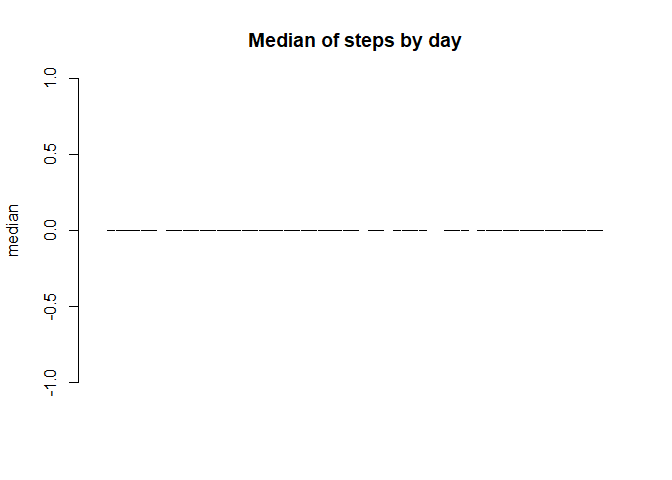
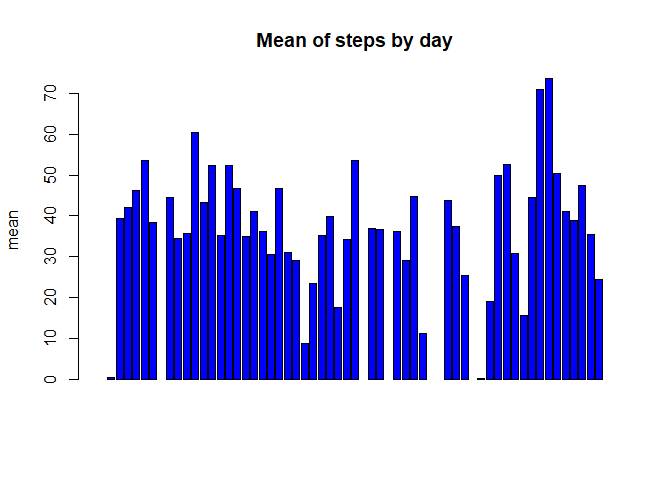
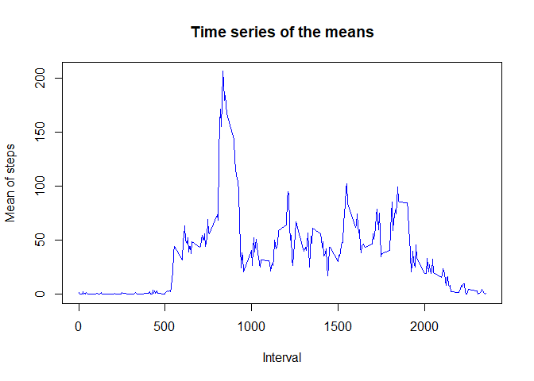
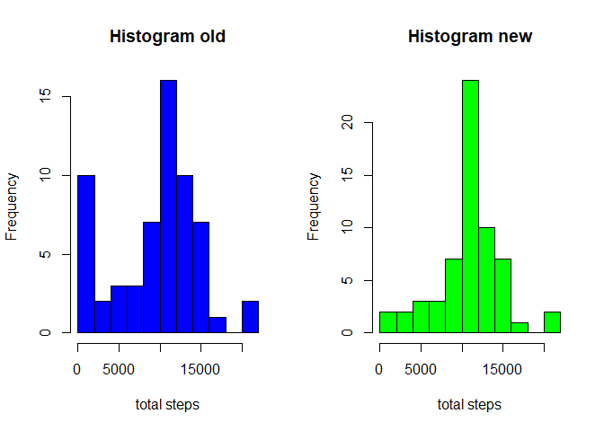
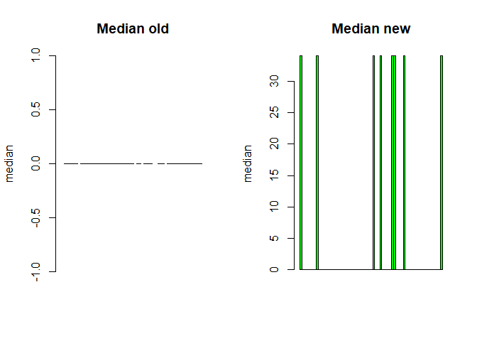
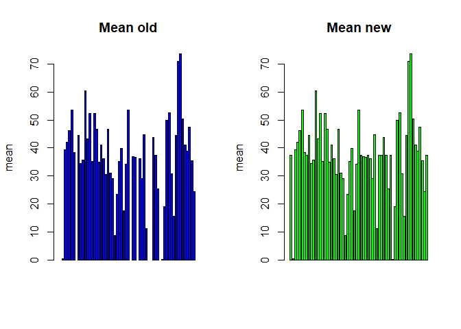
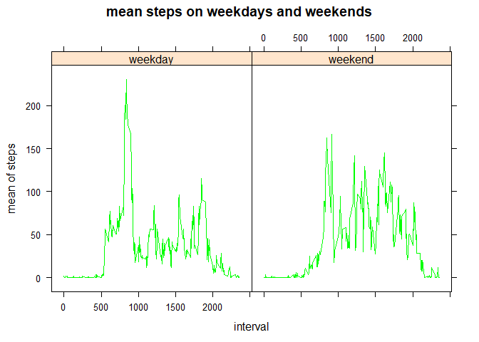

## Loading and preprocessing the data
I have forked the repository and created a local clone of my fork placed in C:\Users\Kristof\Documents\coursera\05-Reproducible_Research\PeerAssessment1\RepData_PeerAssessment1. Then I have set the working directory.

```r{set_working_directory,echo=TRUE}
setwd("~/coursera/05-Reproducible_Research/PeerAssessment1/RepData_PeerAssessment1")
```
Now, I load the libraries, unzip the loaded *activity.zip* directory and read the *activity.csv* file into the data frame **act**.


```r
library(dplyr)
```

```
## Warning: package 'dplyr' was built under R version 3.6.1
```

```
## 
## Attaching package: 'dplyr'
```

```
## The following objects are masked from 'package:stats':
## 
##     filter, lag
```

```
## The following objects are masked from 'package:base':
## 
##     intersect, setdiff, setequal, union
```

```r
library(ggplot2)
library(hrbrthemes)
```

```
## Warning: package 'hrbrthemes' was built under R version 3.6.2
```

```
## NOTE: Either Arial Narrow or Roboto Condensed fonts are required to use these themes.
```

```
##       Please use hrbrthemes::import_roboto_condensed() to install Roboto Condensed and
```

```
##       if Arial Narrow is not on your system, please see http://bit.ly/arialnarrow
```

```r
#library(knitr)
library(lattice)
library(tibble)
library(tidyverse)
```

```
## Warning: package 'tidyverse' was built under R version 3.6.1
```

```
## -- Attaching packages ---------------------------------------- tidyverse 1.2.1 --
```

```
## <U+221A> tidyr   0.8.3     <U+221A> purrr   0.3.2
## <U+221A> readr   1.3.1     <U+221A> stringr 1.4.0
## <U+221A> tidyr   0.8.3     <U+221A> forcats 0.4.0
```

```
## Warning: package 'tidyr' was built under R version 3.6.1
```

```
## Warning: package 'readr' was built under R version 3.6.1
```

```
## Warning: package 'forcats' was built under R version 3.6.1
```

```
## -- Conflicts ------------------------------------------- tidyverse_conflicts() --
## x dplyr::filter() masks stats::filter()
## x dplyr::lag()    masks stats::lag()
```

```r
library(utils)

if(!file.exists("./RepData_PeerAssessment1/activity.csv")){
        unzip("./RepData_PeerAssessment1/activity.zip")
        print("I have unzipped the directory.")
        
        
} else{
        print("The file activity.csv already exists.")
}
```

```
## Warning in unzip("./RepData_PeerAssessment1/activity.zip"): error 1 in
## extracting from zip file
```

```
## [1] "I have unzipped the directory."
```

```r
act<-read.csv("activity.csv")
```


## What is mean total number of steps taken per day?
In this part, we have to take a histogram of total number of steps by days and we have to calculate the mean and median of total number of steps on each day. To this, first we group the data frame **act** by **date**. Then we compute the **total steps** on each day. Using **total_steps**, which is a *tbl_df* object with 2 columns (the *date* and the *total*, which is the total number of steps on the given day), we can take the histogram.

```r
act <- tbl_df(act) %>% group_by(date)

total_steps<-summarize(act,total=sum(steps,na.rm=TRUE))

if(!file.exists("figure")){
                dir.create("figure")
        }

hist(total_steps$total,10,col="blue",
             main="Histogram of total steps by days",
             xlab="total steps",
             ylab="Frequency")
```

<!-- -->

```r
#png("file=./figure/Histogram_total.png")
#hist(total_steps$total,10,col="blue",
#             main="Histogram of total steps by days",
#             xlab="total steps",
#             ylab="Frequency")
#dev.off()
```

Now, we compute the **median_steps** and the **mean_steps**. The variables **median_steps** and **mean-steps** have a class of tbl_df. They have 2 columns: **date** and **MED/MEAN**, respectively. Using the **MED** and **MEAN** columns, we create the barplots.

```r
median_steps <- summarize(act,MED=median(steps,na.rm=TRUE))

mean_steps <- summarize(act,MEAN=mean(steps,na.rm=TRUE))

barplot(median_steps$MED, col="blue",
        main="Median of steps by day",
        ylab="median")
```

<!-- -->

```r
#png("file=./figure/Median_dayly.png")
#barplot(median_steps$MED, col="blue",
#        main="Median of steps by day",
#        ylab="median")
#dev.off()


barplot(mean_steps$MEAN, col="blue",
        main="Mean of steps by day",
        ylab="mean")
```

<!-- -->

```r
#png("file=./figure/Mean_dayly.png")
#barplot(mean_steps$MEAN, col="blue",
#        main="Mean of steps by day",
#        ylab="mean")
#dev.off()
```


## What is the average daily activity pattern?
We have to regroup our dataset by the variable **interval**. In the variable **mean_steps_ts** we compute the mean of steps averaged on the 5-minutes interval. That is, the *k*-th row of **mean_steps_ts** contains the mean of the *k*-th 5-minutes intervals. 

```r
act_ts<-ungroup(act) %>% tbl_df %>% group_by(interval)
mean_steps_ts <- summarize(act_ts,MEAN_ts=mean(steps,na.rm=TRUE))
int_ts <- unique(act_ts$interval)

plot(int_ts,mean_steps_ts$MEAN_ts,type="l", col="blue",
                      main="Time series of the means",
                      xlab="Interval",
                      ylab="Mean of steps")
```

<!-- -->

```r
#png("file=./figure/Timeseries.png")
#plot(int_ts,mean_steps_ts$MEAN_ts,type="l", col="blue",
#                      main="Time series of the means",
#                      xlab="Interval",
#                      ylab="Mean of steps")
#dev.off()
```

Now, we describe the interval, when the number of average steps was the highest.

```r
max_avg_ind<-which.max(mean_steps_ts$MEAN_ts)
max_avg_interv<-as.character(mean_steps_ts$interval[max_avg_ind])
```

So, we have that in the 835-th interval was the highest the average number of steps.


## Imputing missing values
Firstly, the number of the rows, which contains *NA* value can be computed by:

```r
rows_Na <- sum(!complete.cases(act))
print(rows_Na)
```

```
## [1] 2304
```
So, 2304 rows contain *NA*. During the analyzing of the dataset, it turned out, that a day contains only *NA* values or it has no *NA* value. Therefore we can change the *NA* value in the *k*-th 5-minutes interval of the day to the average steps of **this** of this 5-minutes interval. We will create a new dataset. Here is the head of **act** now.

```r
head(act)
```

```
## # A tibble: 6 x 3
## # Groups:   date [1]
##   steps date       interval
##   <int> <fct>         <int>
## 1    NA 2012-10-01        0
## 2    NA 2012-10-01        5
## 3    NA 2012-10-01       10
## 4    NA 2012-10-01       15
## 5    NA 2012-10-01       20
## 6    NA 2012-10-01       25
```

It has *NA* values. Now, we will change the *NA*'s. The new dataset is **act_without_NA**.

```r
act_without_NA<-act
with_na<-is.na(act$steps)
act_without_NA[with_na,]$steps <- mean_steps_ts$MEAN_ts
```

Now, this is the new dataset **act_without_NA** without *NA* values.

```r
head(act_without_NA)
```

```
## # A tibble: 6 x 3
## # Groups:   date [1]
##    steps date       interval
##    <dbl> <fct>         <int>
## 1 1.72   2012-10-01        0
## 2 0.340  2012-10-01        5
## 3 0.132  2012-10-01       10
## 4 0.151  2012-10-01       15
## 5 0.0755 2012-10-01       20
## 6 2.09   2012-10-01       25
```

```r
sum(!complete.cases(act_without_NA))
```

```
## [1] 0
```

Histogram of the total number of steps taken each day.

```r
total_steps_new<-summarize(act_without_NA,total_new=sum(steps,na.rm=TRUE))

par(mfrow=c(1,2))
hist(total_steps$total,10,col="blue",
             main="Histogram old",
             xlab="total steps",
             ylab="Frequency")
hist(total_steps_new$total_new,10,col="green",
             main="Histogram new",
             xlab="total steps",
             ylab="Frequency")
```

<!-- -->

```r
#png("file=./figure/Histogram_old-new.png")
#par(mfrow=c(1,2))
#hist(total_steps$total,10,col="blue",
#             main="Histogram old",
#             xlab="total steps",
#             ylab="Frequency")
#hist(total_steps_new$total_new,10,col="green",
#             main="Histogram new",
#             xlab="total steps",
#             ylab="Frequency")
#dev.off()
```

The median and the mean.

```r
median_steps_new <- summarize(act_without_NA,MED_new=median(steps,na.rm=TRUE))
mean_steps_new <- summarize(act_without_NA,MEAN_new=mean(steps,na.rm=TRUE))

par(mfrow=c(1,2))
barplot(median_steps$MED, col="blue",
        main="Median old",
        ylab="median")
barplot(median_steps_new$MED_new, col="green",
        main="Median new",
        ylab="median")
```

<!-- -->

```r
#png("file=./figure/Median_old-new.png")
#par(mfrow=c(1,2))
#barplot(median_steps$MED, col="blue",
#        main="Median old",
#        ylab="median")
#barplot(median_steps_new$MED_new, col="green",
#        main="Median new",
#        ylab="median")
#dev.off()


par(mfrow=c(1,2))
barplot(mean_steps$MEAN, col="blue",
        main="Mean old",
        ylab="mean")
barplot(mean_steps_new$MEAN_new, col="green",
        main="Mean new",
        ylab="mean")
```

<!-- -->

```r
#png("file=./figure/Mean_old-new.png")
#par(mfrow=c(1,2))
#barplot(mean_steps$MEAN, col="blue",
#        main="Mean old",
#        ylab="mean")
#barplot(mean_steps_new$MEAN_new, col="green",
#        main="Mean new",
#        ylab="mean")
#dev.off()
```


In the first part of the exercise we have in the variables **median_steps** and **mean_steps** *NA* values. During the plot, thanks to to the parameter *na.rm=TRUE* these were omitted. In the second part, we changed the *NA* values of the **steps** variable by the *mean* value of the steps. Thera appeared in the **Median new** and **Mean new** plots.


## Are there differences in activity patterns between weekdays and weekends?
We create a new vriable called **date_day**. This contain the hungarian names of the days. The **weekday** variable gives that the given day is *weekday* or *weekend*. We group the dataset by **interval** and **weekday**. After **summarize** we can plot the groups.

```r
act_without_NA<-ungroup(act_without_NA) %>% tbl_df
date <- as.Date(act_without_NA$date,"%Y-%m-%d")
date_day<-as.factor(weekdays(date))
act_without_NA<-mutate(act_without_NA,day=date_day,weekday="weekday")

act_without_NA$weekday[format(date,"%u") %in% c(6,7)] <- c("weekend")

act_without_NA
```

```
## # A tibble: 17,568 x 5
##     steps date       interval day   weekday
##     <dbl> <fct>         <int> <fct> <chr>  
##  1 1.72   2012-10-01        0 hétfő weekday
##  2 0.340  2012-10-01        5 hétfő weekday
##  3 0.132  2012-10-01       10 hétfő weekday
##  4 0.151  2012-10-01       15 hétfő weekday
##  5 0.0755 2012-10-01       20 hétfő weekday
##  6 2.09   2012-10-01       25 hétfő weekday
##  7 0.528  2012-10-01       30 hétfő weekday
##  8 0.868  2012-10-01       35 hétfő weekday
##  9 0      2012-10-01       40 hétfő weekday
## 10 1.47   2012-10-01       45 hétfő weekday
## # ... with 17,558 more rows
```

```r
act_without_NA <- group_by(act_without_NA,interval,weekday)
mean_wd<-summarise(act_without_NA,mean_wd_wend=mean(steps))

mean_wd <- transform(mean_wd,weekday=factor(weekday))

xyplot(mean_wd_wend ~ interval | weekday, data=mean_wd, type="l",
       col="green",
       main="mean steps on weekdays and weekends",
       xlab="interval",
       ylab="mean of steps")
```

<!-- -->

```r
#png("file=./figure/weekday-weekend.png")
#xyplot(mean_wd_wend ~ interval | weekday, data=mean_wd, type="l",
#       col="green",
#       main="mean steps on weekdays and weekends",
#       xlab="interval",
#       ylab="mean of steps")
#dev.off()
```


We can see from the figures that the activitiy has different pattern in weekdays and in the weekend.
